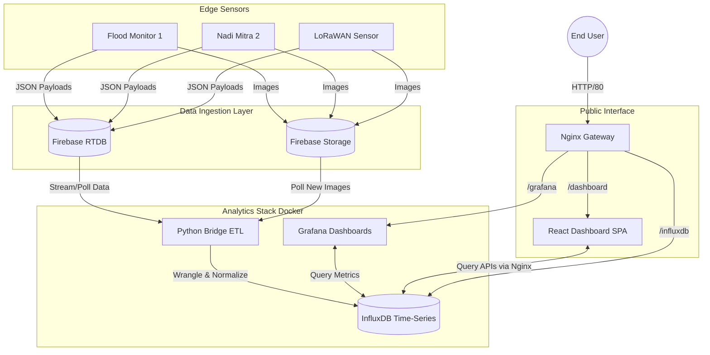

# Himधारा - Real-Time Flood Monitoring & Forecasting System 🌊


A comprehensive, indigenous digital flood monitoring and forecasting system for Himalayan rivers. This platform integrates real-time IoT sensing, robust communication systems (LoRaWAN, GSM), and an analytics stack to provide flash flood early warnings, data visualization, and infrastructure vulnerability assessments.

Developed with support from the **National Mission on Himalayan Studies (NMHS)**, **Sony International Limited, Japan**, and the **Technology Innovation Hub (TIH), IIT Guwahati**.

---

## 🏗️ End-to-End Architecture

The system utilizes an **ETL (Extract, Transform, Load)** pipeline, fully containerized via Docker, to move data from edge IoT devices to real-time public and internal dashboards.



### Core Components
1. **Firebase RTDB & Storage**: Acts as a high-availability ingestion buffer. Edge sensors push semi-structured payloads and capture images here.
2. **Flood Monitor Bridge (`flood-monitor-bridge/`)**: A stateless Python service that polls Firebase. It cleans messy payloads (e.g., converting `"R0845"` to integer `845`), normalizes timestamps (epochs vs ISO), resolves image metadata, and writes clean points to InfluxDB.
3. **InfluxDB (v2)**: The core time-series database acting as the single source of truth for all historical readings.
4. **Grafana**: An internal analytics platform used by data scientists to view raw technical trends, configure alerts, and monitor hardware logs.
5. **Dashboard SPA (`public-dashboard-ui/`)**: A sleek, public-facing React (Vite) Single Page Application providing a curated view of live water levels, battery states, maps, and an image timeline.
6. **Nginx Gateway**: The production reverse proxy that manages all incoming HTTP traffic, sorting requests to the SPA, Grafana, or InfluxDB via URL sub-paths.

---

## 🌐 Networking & Routing

The project uses two distinct routing models depending on the environment:

### Local Development (Direct Ports)
In local dev (`docker-compose.yml`), there is no central gateway. Services expose their unique ports directly to your host machine:
- **InfluxDB**: `localhost:8086`
- **Grafana**: `localhost:3000`
- **React SPA**: `localhost:5173` (via `npm run dev`)

### Production (Nginx Gateway)
In production (`docker-compose.prod.yml`), internal ports are isolated. A single Nginx Gateway listens on Port `80` and routes via sub-paths:
- `http://<server-ip>/` automatically redirects to `/dashboard/`
- Request `.../dashboard/*` -> Serves the compiled React SPA
- Request `.../grafana/*` -> Proxies to Grafana
- Request `.../influxdb/*` -> Proxies to the InfluxDB API (allowing the SPA to securely query data without exposing port `8086`).

> **Note on SPA Routing**: The React app utilizes a **"Magic Basename"** technique. In production, Docker injects `VITE_BASE_PATH=/dashboard/`, allowing `react-router-dom` to dynamically adjust all relative links to work behind the proxy.

---

## ⚙️ Setup & Deployment

### Prerequisites
- Docker & Docker Compose
- Node.js (v20+) for local SPA development
- Python 3.11+ (via `uv`) for local bridge scripts
- A valid `serviceAccountKey.json` from your Firebase project.

### 1. Configuration Files
You must set up a few configuration files before running the stack:

**A. Bridge Environment (`flood-monitor-bridge/.env`)**
```env
DOCKER_INFLUXDB_INIT_MODE=setup
DOCKER_INFLUXDB_INIT_USERNAME=admin
DOCKER_INFLUXDB_INIT_PASSWORD=password123
DOCKER_INFLUXDB_INIT_ORG=kabir-das-org
DOCKER_INFLUXDB_INIT_BUCKET=flood_monitoring
DOCKER_INFLUXDB_INIT_ADMIN_TOKEN=my-super-secret-auth-token
```
*Place your `serviceAccountKey.json` inside the `flood-monitor-bridge/` directory.*

**B. Sensor Configuration (`flood-monitor-bridge/sensor_config.yaml`)**
Defines which sensors the bridge should track, their DB fields, and image storage paths.

**C. SPA Configuration (`public-dashboard-ui/src/config/sensors.json`)**
Defines the sensors visible on the frontend, their exact map coordinates, and UI thresholds.

### 2. Running Local Development
Perfect for active frontend tuning and backend script testing.

```bash
# 1. Start the backend databases & Grafana
cd flood-monitor-bridge
docker compose up -d

# 2. Run the Bridge locally (optional if you want to see standard output)
uv sync
uv run python src/main.py

# 3. Start the React SPA with Hot Module Replacement
cd ../public-dashboard-ui
npm install
npm run dev
```

### 3. Deploying to Production (EC2 / VPS)
This builds the SPA into a static output, boots the Nginx Gateway, and fully containerizes the bridge.

```bash
cd flood-monitor-bridge
docker compose -f docker-compose.prod.yml up -d --build
```
Access the complete dashboard at `http://<your-server-ip>/`.

---

## 🛠️ Simulation & Testing Tools

Don't want to wait for actual floods? Use the included Python simulators!

```bash
cd flood-monitor-bridge
uv sync
```

**Simulate Sensor Data:**
Generates a sine-wave pattern of water levels and pushes to Firebase.
```bash
# Push 100 historical records (useful for testing graphs instantly)
uv run python src/simulate_data.py --mode run --sensor floodmonitor2 --count 100 --interval 120 --delay 0.1 --past

# Push a static value instead of a sine wave
uv run python src/simulate_data.py --mode run --sensor floodmonitor2 --count 10 --static-value 250
```

**Verify Bridge Flow:**
Checks InfluxDB to confirm data actually arrived and the state cursor updated.
```bash
uv run python src/verify_data.py
```

---

## 📊 Grafana Setup

Grafana spins up blank on first boot. To set up:
1. Login with `admin` / `admin`.
2. **Add Data Source:**
   - Type: `InfluxDB`
   - Query Language: `Flux`
   - URL: `http://influxdb:8086`
   - Organization: `kabir-das-org`
   - Token: Use your secret token from `.env`
3. **Import Dashboard:** Upload `grafana_dashboard.json` (located in `flood-monitor-bridge/`).

---
*Built by the HimDhara Development Team.*
