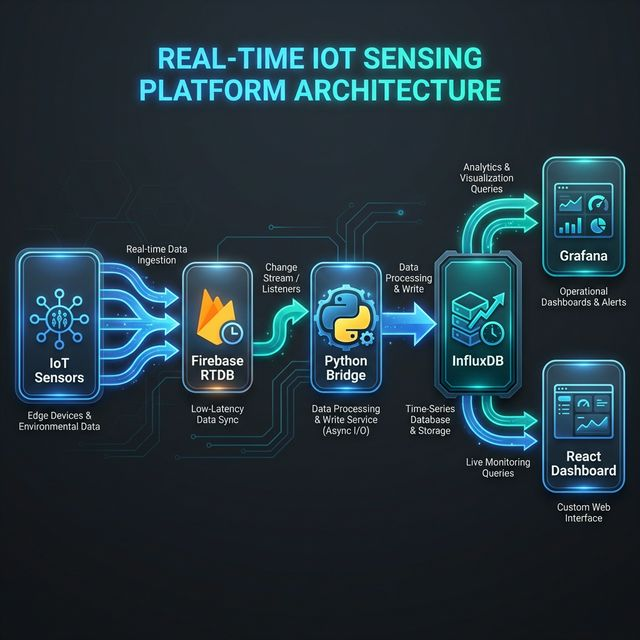
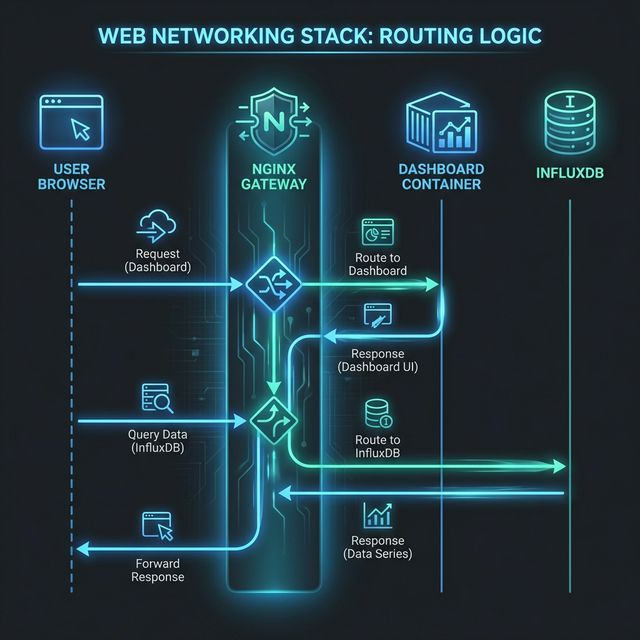

# End-to-End Networking and Routing Architecture

This document provides a comprehensive breakdown of how data flows through the RT Sensing Dashboard platform, detailing how the specific networking and routing layers differ between Local Development and Production environments.

---

## 1. System Overview

The platform uses an ETL (Extract, Transform, Load) pipeline. The networking architecture facilitates the movement of raw data from edge devices to the final visualizations in the User Interface.



1.  **Ingestion:** IoT Sensors push data to **Firebase RTDB** via the public internet.
2.  **Processing:** A Python Bridge service (running in a Docker network) acts as a background listener. It extracts arriving data, normalizes it, and writes it directly to the Time-Series database (**InfluxDB**).
3.  **Visualization:** End-user applications (**Grafana** and the **React Dashboard SPA**) query InfluxDB to display the processed metrics.

---

## 2. Local Stack Overview (Direct Port Mapping)

In the local environment (`docker-compose.yml`), simplicity is prioritized. There is no central router or gateway. Each critical service exposes its own unique port directly to the host machine.

| Service | Container Port | Host Port | Purpose |
| :--- | :--- | :--- | :--- |
| **InfluxDB** | `8086` | **`8086`** | Database API and UI Access |
| **Grafana** | `3000` | **`3000`** | Admin Visualization |
| **Dashboard** | `80` | **`5173`** | Static React UI (Optional) |

### Internal vs External Resolution
- **Internal (Backend):** Because the Python Bridge runs *inside* the Docker network alongside InfluxDB, it resolves the database using the internal Docker DNS name: `http://influxdb:8086`.
- **External (Frontend):** Because the Single Page Application (SPA) executes entirely inside your web browser (on the host OS), it has no access to the Docker internal network. It **must** resolve the database using localhost: `http://localhost:8086`.

---

## 3. Local SPA Developer Workflows

Since the dashboard SPA runs in your browser, its deployment and build lifecycle locally can be handled in two distinct ways to suit different needs:

### A. Terminal Mode (`npm run dev`)
- **How it works**: The Vite development server reads your React source code directly from your hard drive.
- **Build needed?**: **No.** It uses Hot Module Replacement (HMR) to instantly push code edits to the browser in milliseconds.
- **Routing Base**: Serves from the root path `/` (`http://localhost:5173/`).
- **Data Fetching**: Pulls environment variables from `public-dashboard-ui/.env` (`VITE_INFLUX_URL=http://localhost:8086`).
- **Best for**: Rapid UI component development and layout tuning.

### B. Docker Mode (`docker compose up`)
- **How it works**: The `dashboard` container replicates production by executing a full `npm run build` and serving the resulting static files via a lightweight Nginx process.
- **Build needed?**: **Yes.** Since the code is "baked" into a static `dist/` folder inside the container, saving a React file in your editor will do nothing. You must run `docker compose build dashboard` to re-compile your changes.
- **Routing Base**: Serves from the root path `/` (`http://localhost:5173/`).
- **Data Fetching**: Pulls environment variables injected via args in `docker-compose.yml` (`VITE_INFLUX_URL=http://localhost:8086`).
- **Best for**: Full end-to-end integration testing simulating the production build process.

---

## 4. Production Stack Overview (Nginx Gateway)

In the production environment on EC2 (`docker-compose.prod.yml`), the architecture shifts dramatically to a **Gateway Pattern**.

Direct ports are closed off for security. Instead, a primary **Nginx Gateway** sits at the front of the server, listening to standard Port `80`. It intercepts all incoming requests and routes them to the correct internal containers based entirely on the URL **Sub-Path**.



### The Gateway Routing Logic:
1.  **Request to `http://your-server/`** → Redirects user entirely to `/dashboard/`.
2.  **Request to `/dashboard/...`** → Proxied silently to the static Nginx serving the SPA.
3.  **Request to `/grafana/...`** → Proxied silently to the Grafana container (with WebSockets supported).
4.  **Request to `/influxdb/...`** → Proxied silently to the InfluxDB API. This hides port `8086` completely from the public internet, allowing the SPA to fetch data securely.

---

## 5. Production SPA Routing Magic (`basename`)

Serving a React Single Page Application from a sub-path (`/dashboard/`) instead of the root (`/`) introduces complex problems for the internal router. If a user clicks a link to the settings page, the browser needs to go to `/dashboard/settings`, not `/settings`.

To solve this without breaking local development, the platform uses a **"Magic Basename" technique** via `react-router-dom`:

### The Implementation in `src/main.jsx`
```javascript
// Grab the base path injected at build time (defaults to root '/')
const basePath = import.meta.env.VITE_BASE_PATH || '/'

// Wrap the app, telling the Router its home directory
<BrowserRouter basename={basePath}>
  <App />
</BrowserRouter>
```

### How this enables seamless cross-environment code:
When you, the developer, write a link in a component: `<Link to="/settings">Go to Settings</Link>`

- **In Local Environment:** `basePath` is empty. The router evaluates the link as `http://localhost:5173/settings`.
- **In Production Environment:** The Docker build injects `VITE_BASE_PATH=/dashboard/`. The router **automatically prepends** the sub-path, evaluating the exact same code link as `http://your-server/dashboard/settings`.

You never have to hardcode `/dashboard/` into your React code. You write standard relative paths, and the build arguments handle the environments.

---

## 6. API Environment Injection

Just as the SPA needs to know its own base path, it must know how to reach InfluxDB. Because Vite is a static bundler, these URLs are "baked in" permanently during the build step.

- **Local Development**: The browser needs to reach the database directly. We inject the host: `VITE_INFLUX_URL=http://localhost:8086`.
- **Production**: The browser cannot reach port 8086. It must ask the Nginx Gateway to fetch the data. We inject the relative sub-path: `VITE_INFLUX_URL=/influxdb`. The frontend simply makes a `POST` request to `/influxdb/api/v2/query`, and the gateway handles forwarding it to the secure container database.
